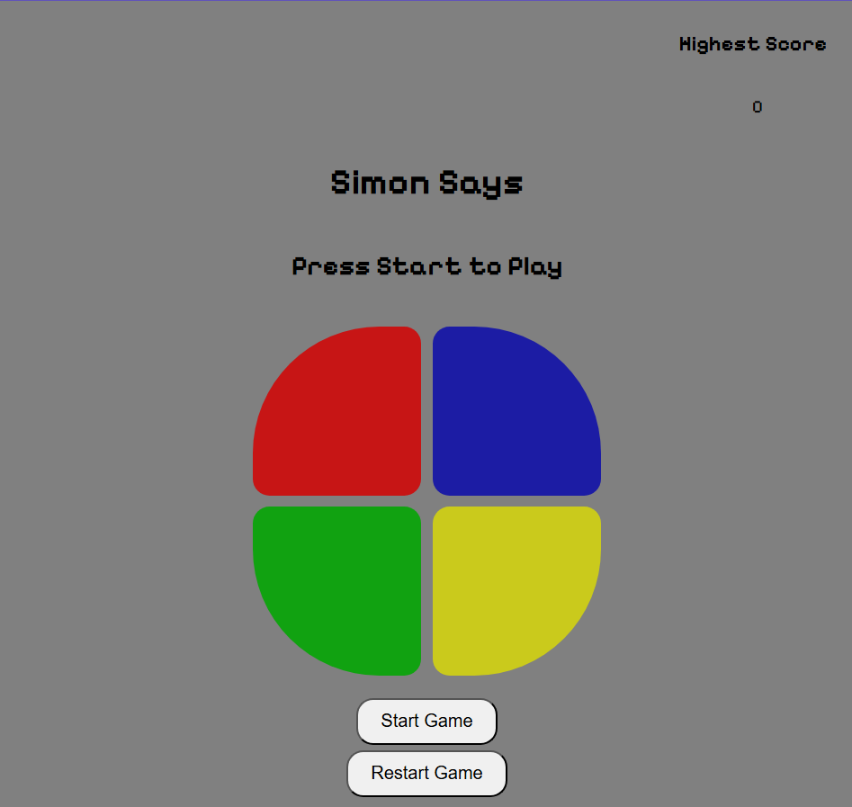

# Simon Says

*A browser-based memory game inspired by the classic Simon Says.*



## Overview

Simon Says is a memory game where players must watch and remember an increasingly long sequence of colored lights. Repeat the sequence correctly to advance through the levels, and try to beat your highest score before making a mistake.

## Getting Started

### Play the Game

Clone the repository and open `index.html` in your browser.

### How to Play

1. Click **Start Game** to begin.
2. Watch the sequence of colors shown by the game.
3. Repeat the sequence by clicking the colored buttons in the same order.
4. Each successful round increases the level and extends the sequence.
5. If you click the wrong color, the game ends and a popup displays the level you reached.
6. Return to the start screen and see if you can beat your highest score.

## Installation

No installation is required. Simply clone the repository and open the `index.html` file in your browser.

```bash
git clone https://github.com/3zoozCreature/simon-says-game.git
cd simon-says-game
open index.html
```

Alternatively, download the project as a ZIP file and open `index.html`.

## Technologies Used

* HTML
* CSS
* JavaScript

## Features

* Classic Simon Says gameplay
* Randomly generated color sequences
* Increasing difficulty as the game progresses
* Sound effects for each color
* Animated button highlights
* High score tracking
* Game Over popup showing the level reached
* Restart game functionality

## Future Enhancements

* Save the highest score using Local Storage.
* Add multiple difficulty levels.
* Add keyboard controls.
* Include additional sound and visual themes.
* Improve mobile responsiveness.
* Add a leaderboard or score history.
